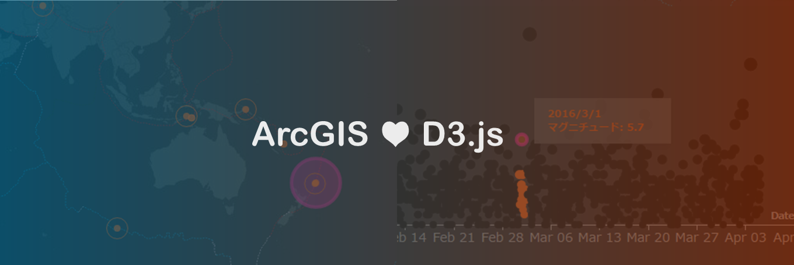
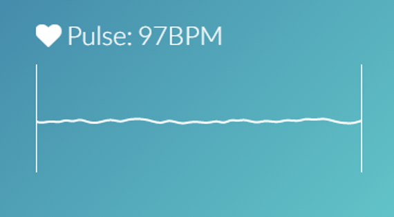
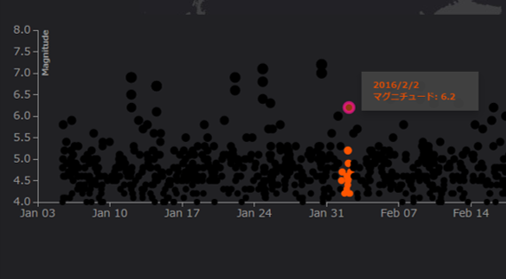

# D3 Components for Esri JSAPI

ArcGIS API for JavaScript で Web アプリを開発する際に利用可能な D3 コンポーネントです。

## 使用している製品・プロジェクト

* [D3.js](https://d3js.org/)
* [Dojo](https://dojotoolkit.org/)
* [ArcGIS API for JavaScript](https://developers.arcgis.com/javascript/)
* [ArcGIS for Developers](https://developers.arcgis.com/en/)

**ArcGIS の開発キットを使用して開発を行う場合は ArcGIS Online 開発者アカウント（[ArcGIS for Developers](https://developers.arcgis.com/en/)）が必要です。開発者アカウント作成ガイドは[こちら](https://github.com/EsriJapan/arcgis-dev-resources/blob/master/pages/get-dev-account.md)**

## コンポーネント

<table>
    <tr valign="top">
        <td width="25%"><a href="http://esrijapan.github.io/arcgis-d3-components/examples/animated-sparkline.html"> Animated Sparkline</a></td>
        <td width="25%"><a href="http://esrijapan.github.io/arcgis-d3-components/examples/scatterplot-by-time.html"> Scatterplot by Time</a></td>
        <td width="25%"><a href=""> </a></td>
        <td width="25%"><a href=""> </a></td>
    </tr>
</table>

## ライセンス
Copyright 2016 Esri Japan Corporation.

Apache License Version 2.0（「本ライセンス」）に基づいてライセンスされます。あなたがこのファイルを使用するためには、本ライセンスに従わなければなりません。本ライセンスのコピーは下記の場所から入手できます。

> http://www.apache.org/licenses/LICENSE-2.0

適用される法律または書面での同意によって命じられない限り、本ライセンスに基づいて頒布されるソフトウェアは、明示黙示を問わず、いかなる保証も条件もなしに「現状のまま」頒布されます。本ライセンスでの権利と制限を規定した文言については、本ライセンスを参照してください。

ライセンスのコピーは本リポジトリの[ライセンス ファイル](./LICENSE)で利用可能です。

